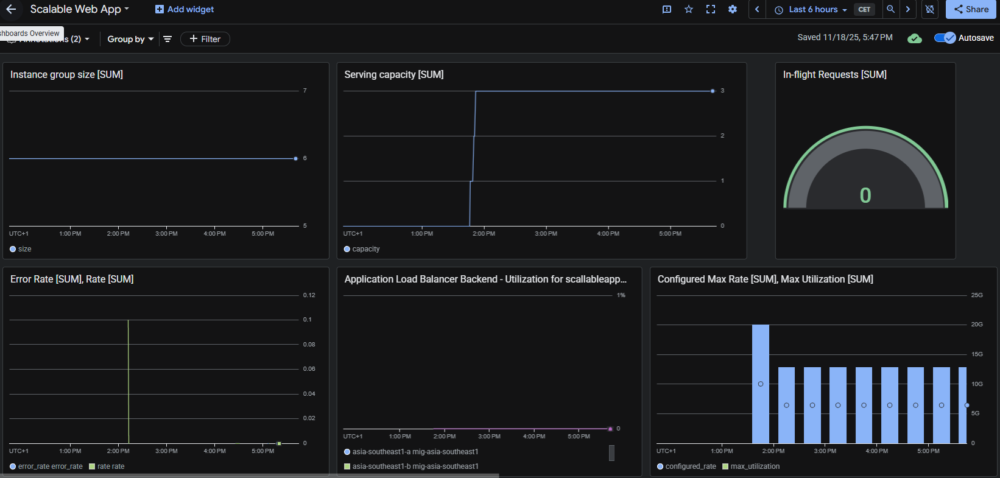
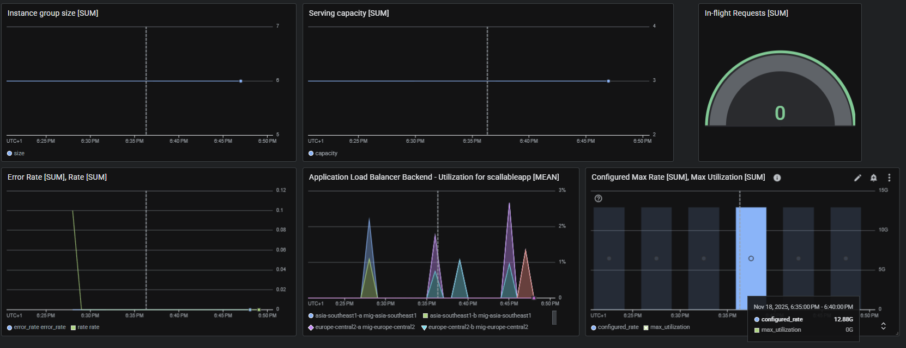
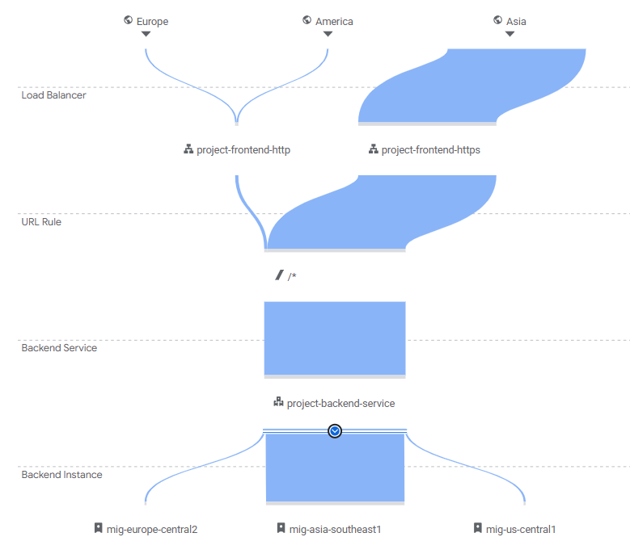
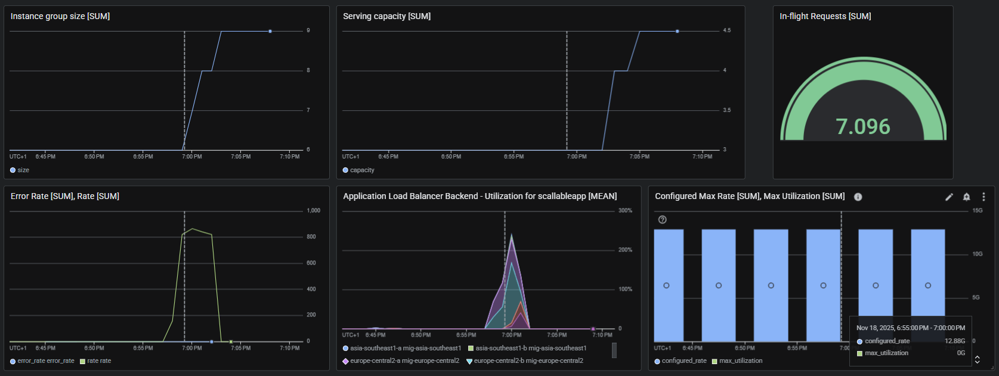
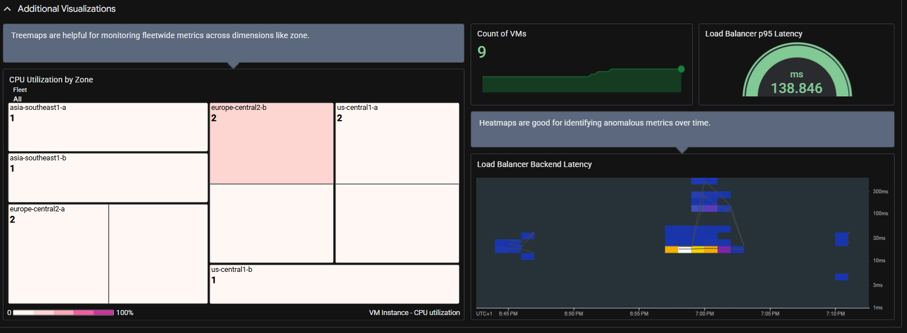
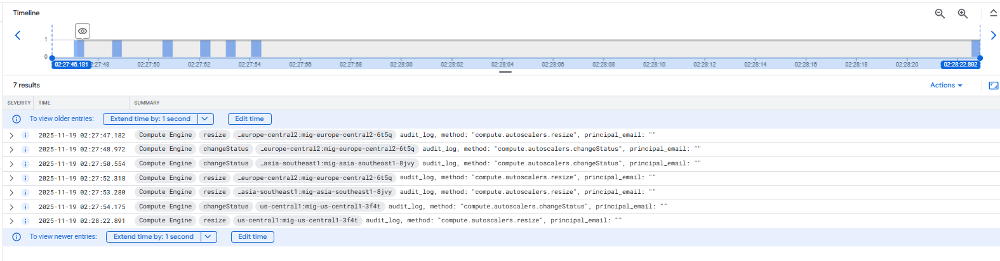
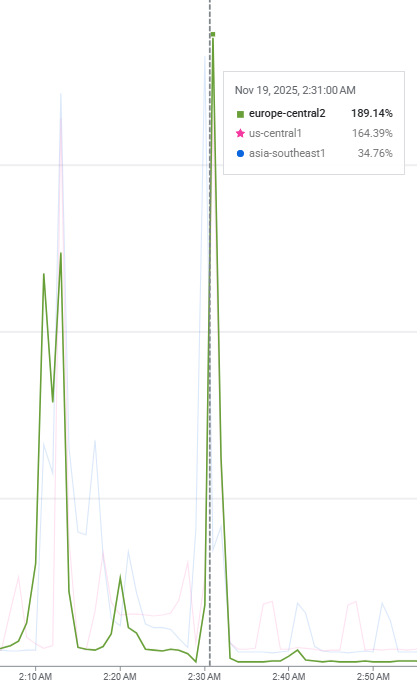
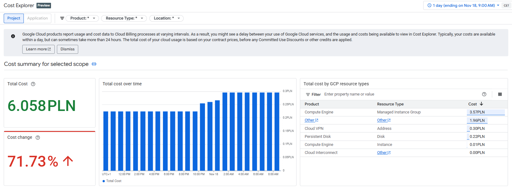
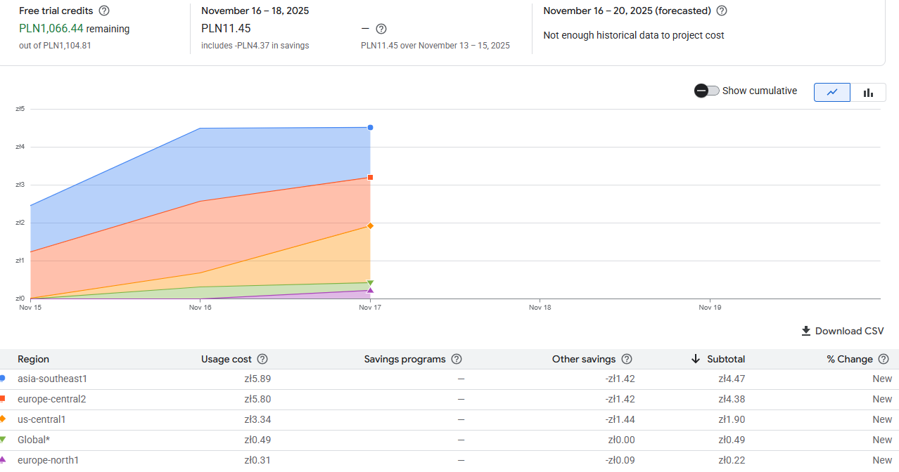

# Scalable Web Application Infrastructure with Load Balancing and Monitoring

## Introduction
The project is about establishing a **Scalable Web Application Infrastructure with Load Balancing and Monitoring** as part of the Cloud Computing and DevOps training. 

This documentation describes this process and includes:
- Creation of a **VPC network** with 3 subnets.
- Creation of an **Instance Template**.
- Creation of an **Managed Instance Group (MIG)**, enabling **Autoscaling** and **Health Checks**.
- Configuration of an **HTTP(S) Load Balancer** with an SSL certificate.
- Configuration of **Cloud Monitoring and Logging** (dashboards, alerts).
- Implementation of **Load Tests**.
- **Scaling Cost Impact** analysis report.


## Step 1. Create VPC Network
**How it's built:**
We created a VPC network that contains three subnets, one for each of the tree main graographic areas offered by Google Cloud: Europe, Asia and Americas. We selected the following regions:
- us-central1 (Iowa)
- europe-central2 (Warsaw)
- asia-southeast1 (Singapore)

**In this step**:
- [VPC network with subnets](#vpc-network-with-subnets)
- [Firewall rules](#firewall-rules)

### VPC network with subnets
```bash
# Set Project 
gcloud config set project group-project-478401

# Created custom mode VPC Network
gcloud compute networks create vpc-project-network \
    --subnet-mode=custom

# Created 3 subnets (US, EU, Asia)
gcloud compute networks subnets create vpc-project-subnet-us-central1 \
    --network=vpc-project-network \
    --region=us-central1 \
    --range=10.1.0.0/24

gcloud compute networks subnets create vpc-project-subnet-europe-central2 \
    --network=vpc-project-network \
    --region=europe-central2 \
    --range=10.2.0.0/24

gcloud compute networks subnets create vpc-project-subnet-asia-southeast1 \
    --network=vpc-project-network \
    --region=asia-southeast1 \
    --range=10.3.0.0/24
```

### Firewall rules
After successful creation of our VPC network, we also added firewall rule required for the Google Cloud health check used by our future Global External Load Balancer:

```bash
# Firewall rule for Google Cloud health check
gcloud compute firewall-rules create vpc-project-allow-health-check
    --network=vpc-project-network  \
    --description="Allow traffic from Google Cloud health checking systems" \ 
    --direction=INGRESS \
    --source-ranges=130.211.0.0/22,35.191.0.0/16 \
    --action=ALLOW \
    --rules=tcp:80

# Then, we confirmed that the configured rule is active and functioning in our VPC network using command below:
gcloud compute firewall-rules list --filter="network:vpc-project-network"
```


## Step 2. Create Instance Template
**How it's built:**
We prepare a **startup script** containing a simple application using Nginx and define **three instance templates**, one for each geographic region.

**In this step**:
- [Startup script](#startup-script)
- [Instance templates](#instance-templates)

### Startup script
```bash
#!/bin/bash
sudo apt install -y telnet
sudo apt install -y nginx
sudo systemctl enable nginx
sudo chmod -R 755 /var/www/html
HOSTNAME=$(hostname)
IP_ADDRESS=$(hostname -I)
sudo echo "<!DOCTYPE html>
<html>
<head>
    <style>
        body {
            font-family: 'Segoe UI',  sans-serif;
            margin: 0;
            display: flex;
            justify-content: center;
            align-items: center;
            min-height: 100vh;
            background-color: #f0f2f5;
        }
        .container {
            background-color: #ffffff;
            padding: 40px;
            border-radius: 12px;
            box-shadow: 0 4px 12px rgba(0, 0, 0, 0.1);
            text-align: center;
            border-left: 8px solid #007bff;
            max-width: 450px;
            width: 90%;
        }
        h1 {
            color: #333333;
            margin-bottom: -10px;
        }
        h2 {
            color: #007bff;
            font-weight: 300;
      		margin-bottom: 12px;
        }
        p {
            font-size: 16px;
            color: #555;
            margin: 10px 0;
            border-bottom: 1px dashed #eee;
            padding-bottom: 5px;
        }
        p:last-child {
            border-bottom: none;
            padding-bottom: 0;
            margin-top: 20px;
            font-style: italic;
            color: #999;
        }
        strong {
            font-weight: 600;
            color: #333333;
            display: inline-block;
            text-align: right;
            margin-right: 10px;
        }
    </style>
</head>
<body>
    <div class='container'>
        <h1>Projekt grupowy</h1>
        <h2>Cloud Computing & DevOps</h2>
        
        <p><strong>VM Hostname:</strong> ${HOSTNAME}</p>
        <p><strong>VM IP Address:</strong> ${IP_ADDRESS}</p>
        
        <p>Pozdrawiamy</p>
    </div>
</body>
</html>" | sudo tee /var/www/html/index.html

```

### Instance templates
We created **3 instance templates** according to the three mentioned regions (US, EU, Asia):

```bash
# Instance template us-central1
gcloud compute instance-templates create project-instance-template-us \
    --region=us-central1 \
    --network=vpc-project-network \
    --subnet=vpc-project-subnet-us-central1 \
    --machine-type=e2-micro \
    --metadata-from-file=startup-script=apka.sh

# Instance template europe-central2
gcloud compute instance-templates create project-instance-template-eu \
    --region=europe-central2 \
    --network=vpc-project-network \
    --subnet=vpc-project-subnet-europe-central2 \
    --machine-type=e2-micro \
    --metadata-from-file=startup-script=apka.sh

# Instance template asia-southeast1
gcloud compute instance-templates create project-instance-template-asia \
    --region=asia-southeast1 \
    --network=vpc-project-network \
    --subnet=vpc-project-subnet-asia-southeast1 \
    --machine-type=e2-micro \
    --metadata-from-file=startup-script=apka.sh

```


## Step 3. Create Managed Instance Group (MIG), Health Check and Auto-Scaling
**How it's built:**
Since we have just created instance templates for each of the three regions, three MIGs will be created (one for each region) with initial **2 VM instances** deployed across two zones to ensure HA.

**In this step**:
- [Create Health check](#health-check)
- [Managed Instance Groups (MIGs)](#managed-instance-groups-migs)
- [Autoscaling for MIGs](#autoscaling-for-migs)
- [Architecture achieved](#architecture-achieved)

### Health check
We haven’t created a **Health Check** yet, so we will do that in this step.

```bash
gcloud compute health-checks create http project-global-http-health-check \ 
    --port 80 \
    --check-interval 10s \
    --timeout 10s \
    --unhealthy-threshold 3 \
    --healthy-threshold 2
```

### Managed Instance Groups (MIGs)
> *MIG for us-central1 region*

```bash
#  Create the Managed Instance Group (MIG) and select the instance template
gcloud compute instance-groups managed create mig-us-central1 \
  --template=project-instance-template-us \
  --size=2 \
  --zones=us-central1-a,us-central1-b \
  --health-check=project-global-http-health-check

# Add a named port to this instance group
gcloud compute instance-groups set-named-ports mig-us-central1 \
    --named-ports=webserver80:80 \
    --region=us-central1
```

> *MIG for europe-central2 region*

```bash
#  Create the Managed Instance Group (MIG) and select the instance template
gcloud compute instance-groups managed create mig-europe-central2 \
  --template=project-instance-template-eu \
  --size=2 \
  --zones=europe-central2-a,europe-central2-b \
  --health-check=project-global-http-health-check

# Add a named port to this instance group
gcloud compute instance-groups set-named-ports mig-europe-central2 \
    --named-ports=webserver80:80 \
    --region=europe-central2
```

> *MIG for asia-southeast1 region*
```bash
#  Create the Managed Instance Group (MIG) and select the instance template
gcloud compute instance-groups managed create mig-asia-southeast1 \
  --template=project-instance-template-asia \
  --size=2 \
  --zones=asia-southeast1-a,asia-southeast1-b \
  --health-check=project-global-http-health-check

# Add a named port to this instance group
gcloud compute instance-groups set-named-ports mig-asia-southeast1 \
    --named-ports=webserver80:80 \
    --region=asia-southeast1

```

### Autoscaling for MIGs
We are adding **scaling based on HTTP(S) load balancing serving capacity.**
The autoscaler uses the Compute Engine Service Agent to add and remove instances in the group. Google Cloud automatically creates this service account, as well as its **IAM policy** binding to the Compute Engine Service Agent role, when the Compute Engine API is enabled.
```bash
# And add an autoscaling for MIG us-central1 region
gcloud compute instance-groups managed set-autoscaling mig-us-central1 \
  --region=us-central1 \
  --min-num-replicas=2 \
  --max-num-replicas=4 \
  --target-load-balancing-utilization=0.5

# And add an autoscaling for MIG europe-central2 region
gcloud compute instance-groups managed set-autoscaling mig-europe-central2 \
  --region=europe-central2 \
  --min-num-replicas=2 \
  --max-num-replicas=4 \
  --target-load-balancing-utilization=0.5

# And add an autoscaling for MIG asia-southeast1 region
gcloud compute instance-groups managed set-autoscaling mig-asia-southeast1 \
  --region=asia-southeast1 \
  --min-num-replicas=2 \
  --max-num-replicas=4 \
  --target-load-balancing-utilization=0.5
```
### Architecture achieved
```
Region: us-central1          Region: europe-central2         Region: asia-southeast1
├─ Zone: us-central1-a       ├─ Zone: europe-central2-a      ├─ Zone: asia-southeast1-a
│  └─ VM Instance (nginx)    │  └─ VM Instance (nginx)       │  └─ VM Instance (nginx)
└─ Zone: us-central1-b       └─ Zone: europe-central2-b      └─ Zone: asia-southeast1-b
   └─ VM Instance (nginx)       └─ VM Instance (nginx)          └─ VM Instance (nginx)
```

## Step 4. HTTP(S) Load Balancer configuration
**How it's built:**
For our scalable, multi-region infrastructure built on Managed Instance Groups (MIGs), we require a global external Load Balancer to act as a reverse proxy. The Load Balancer automatically distributes traffic to the geographically nearest healthy regional backends.

**In this step**:
- [Backend service configuration](#backend-service-configuration)
- [Frontend services configuration](#frontend-services-configuration)
    - [Reserve external static IP address](#reserve-external-static-ip-address)
    - [SSL certificate](#ssl-certficate)
    - [Create a target proxy](#create-a-target-https-proxy)
    - [Set forwarding rule ](#set-forwarding-rule-to-route-incoming-requests-to-the-proxy)
- [(BONUS) Step-by-step using Web Console](#bonus-quick-setup-using-web-console)

### Backend service configuration
```bash
# Create a backend service
gcloud compute backend-services create project-backend-service \
    --load-balancing-scheme=EXTERNAL_MANAGED \
    --protocol=HTTP \
    --port-name=webserver80 \
    --health-checks=project-global-http-health-check \
    --enable-logging \
    --global

# Add instance groups to backend service
# mig-us-central1 
gcloud compute backend-services add-backend project-backend-service \
    --instance-group=mig-us-central1 \
    --instance-group-region=us-central1 \
    --balancing-mode=UTILIZATION \
    --max-utilization=0.8 \
    --global

# mig-europe-central2
gcloud compute backend-services add-backend project-backend-service \
    --instance-group=mig-europe-central2 \
    --instance-group-region=europe-central2 \
    --balancing-mode=UTILIZATION \
    --max-utilization=0.8 \
    --global

# mig-asia-southeast1 
gcloud compute backend-services add-backend project-backend-service \
    --instance-group=mig-asia-southeast1 \
    --instance-group-region=asia-southeast1 \
    --balancing-mode=UTILIZATION \
    --max-utilization=0.8 \
    --global

# create URL map to route incoming requests (HTTPS) to backend service 
gcloud compute url-maps create project-load-balancer \
  --default-service=project-backend-service
```


### Frontend services configuration

#### Reserve external static IP address

```bash
# Reserve external static IP
gcloud compute addresses create project-global-lb-ip \
    --ip-version=IPV4 \
    --global
```

#### SSL certficate
We can create Google-managed SSL certificate using these commands...
```bash
gcloud compute ssl-certificates create CERTIFICATE_NAME \
    --domains=DOMAIN_LIST \
    --global
```

... however, for the purpose of this project (mainly learning and testing) we will use a **Self-signed certificate**. It can be easily replace with a Google-managed one when the system moves to production stage.

```bash
# Create Self-signed certificate
openssl genrsa -out private.key 2048
openssl req -new -x509 -key private.key -out certificate.crt -days 365 -subj "/CN=project-loadbalancer.local/O=Testing/OU=IT"
gcloud compute ssl-certificates create project-cert \
    --certificate=certificate.crt \
    --private-key=private.key

# Check if ssl-certificate is created
gcloud compute ssl-certificates list
# Response
NAME: project-cert
TYPE: SELF_MANAGED
CREATION_TIMESTAMP: 2025-11-17T15:03:33.290-08:00
EXPIRE_TIME: 2026-11-17T15:03:16.000-08:00
REGION: 
MANAGED_STATUS: 
```

#### Create a target HTTPS proxy
```bash
gcloud compute target-https-proxies create project-target-https-proxy \
    --ssl-certificates=project-cert \
    --url-map=project-load-balancer \
```

#### Set forwarding rule to route incoming requests to the proxy
```bash
gcloud compute forwarding-rules create project-frontend-https \
  --network-tier=PREMIUM \
  --address=project-global-lb-ip \
  --target-https-proxy=project-target-https-proxy \
  --ports=443 \
  --global

```

After a few minutes, our infrastructure is ready to be tested.

### (BONUS) Quick Setup using Web Console:
**Using Web Console: Global External Application Load Balancer**
- Network Services → Load balancing → **Create load balancer**
- **Type of load balancer:**  Application load balancer (HTTP/HTTPS)
- **Public facing or internal:** Public facing (external)
- **Global or single-region deployment:** Multiple regions (global workloads)
- **Load balancer generation:** Global external application load balancer
- **Load balancer name:** project-load-balancer
- **Frontend configuration:** *below*
- **Backend configuration:** *below*
- **Routing rules:** Simple host and path rule

**Using Web Console: Frontend configuration**
- **Add Frontend IP and port**
> HTTP Frontend IP and port
- **Name:** project-frontend-http
- **Network Service Tier:** Premium
- **Port:** 80
- **IP address:** static
    - **Name:** project-global-lb-ip
> HTTPS Frontend IP and port
- **Name:** project-frontend-https
- **Network Service Tier:** Premium
- **Port:** 443
- **IP address:** static
    - **Name:** project-global-lb-ip
- **Classic Certificates**
    - **Name:** project-cert

**Using Web Console: Backend service configuration**
- **Create back-end service**
- **Name:** project-backend-service
- **Backend type:** Instance group
- **Protocol:** HTTP
- **Named port:** webserver80
- **Timeout:** 30
- **Health check:** project-global-http-health-check
- **Backends:**
    > Backend service: us-central1 region
    - **Instance group:** mig-us-central1
    - **Balancing mode**: Utilization
    - **Port numbers:** 80
    > Backend service: europe-central2 region
    - **Instance group:** mig-europe-central2 
    - **Balancing mode**: Utilization
    - **Port numbers:** 80
    > Backend service: asia-southeast1 region
    - **Instance group:** asia-southeast1
    - **Balancing mode**: Utilization
    - **Port numbers:** 80

- **Cloud CDN:** Disable
- **Cloud Armor:** None

## Step 5. Cloud Monitoring and Logging configuration
We configured monitoring and alerting to see the behavior of the application, load balancer, and auto-scaling process in all three regions in real time.


### Monitoring and Logging require APIs to be enabled (usually active by default):
``` bash
gcloud services enable monitoring.googleapis.com logging.googleapis.com
```

### Dashboard „Scalable Web App”
> Monitoring Dashboards  
- Create Dashboard  
    Nazwa: **Scalable Web App**
- Add Widgets
   - **Instance group size**  
   Metric: Instance Group - Instance Group Size (Line Chart)
   - **Serving capacity**  
   Autoscaler - Serving capacity (Line Chart)
   - **In-flight Requests**  
   Load Balancer backend → In-flight Requests (Gauge)
   - **Error Rate, Rate**  
   Load Balancer Backend → Error Rate  
   Load Balancer Backend → Rate   
   - **Application Load Balancer Backend - Utilization**  
   Application Load Balancer Backend - Utilization (Stacked area chart)
   - **Configured Max Rate, Max Utilization**  
    Load Balancer Backend → Configured Max Rate
    Application Load Balancer Backend - Max Utilization

> Illustrative image for the dashboard



> Alerting
- Create policy
    - **CPU usage above 60%**  
    VM Instance - CPU utilization 
    - **Above 50 errors over 5 min**   
    Load Balancer Backend - Error Rate 
    - **Max instances for MIG us-central1**   
     Instance Group - Instance group size
    - **Max instances for MIG europe-central2**   
     Instance Group - Instance group size
    - **Max instances for MIG asia-southeast1**   
     Instance Group - Instance group size

## Step 6. Load Tests

**How it's built:**
To conduct load tests, we prepared **three Virtual Machines** (VMs) acting as **Traffic Generators**, deployed across three different regions. From these machines, we generate traffic directed towards the **Global External Load Balancer** (External IP) by connecting directly to the VM shells (via SSH). Our Load Balancer distributes this load to the **Managed Instance Groups** (MIGs).



**In this step**:
- [Get External IP address](#get-information-about-a-static-external-ip-address)
- [Startup script for traffic generators VMs](#startup-script-for-traffic-generators-vms)
- [Traffic generators - VMs](#traffic-generators---vms)
- [Load tests implementation](#load-tests-implementation)
- [Insights](#insights)

### Get information about a static external IP address
```bash
gcloud compute addresses describe project-global-lb-ip --global
# Response
address: 34.117.144.129
addressType: EXTERNAL
```
### Startup script for traffic generators VMs
```bash
#!/bin/bash
sudo apt update
sudo apt install -y apache2-utils
```

### Traffic generators - VMs
```bash
# Set new project for clarity
gcloud config set project sunny-mender-472316-i8

# traffic generator from the US
gcloud compute instances create traffic-generator-us \
    --zone=us-south1-a \
    --machine-type=e2-micro \
    --metadata-from-file=startup-script=generator.sh

# traffic generator from the Europe 
gcloud compute instances create traffic-generator-europe \
    --zone=europe-west4-a \
    --machine-type=e2-micro \
    --metadata-from-file=startup-script=generator.sh

# traffic generator from the Asia 
gcloud compute instances create traffic-generator-asia \
    --zone=asia-southeast1-a \
    --machine-type=e2-micro \
    --metadata-from-file=startup-script=generator.sh
```
### Load tests implementation 
#### Tests with curl
```bash
# Using the -k flag to validate request without SSL certificate verification
curl -k https://34.117.144.129/
# Repeat for eg. 50 times
for i in {1..1000}; \
    do curl -s -k https://34.117.144.129/; \
 done
```

#### Example of results (Dashboard view)


#### Example of results from Load balancer details (Monitoring view)
Traffic from the VM (Asia) was generated correctly. The Load Balancer successfully distributes this traffic to the closest geograhical MIG.



#### Tests with ab
```bash
# load test
ab -n 1000 -c 50 https://34.117.144.129/

# heavy load test
ab -n 200000 -c 500 https://34.117.144.129/
```
#### Examples of results (Dashboard views)



### Insights
We can examine how the network traffic was routed using the Load Balancer Monitoring View. Most of the traffic coming from Asia was directed to the MIG in the asia-southeast1 region. Traffic that could not be handled due to overload was redirected to MIGs in other geographic regions (these redirect are shown in the figure below).


>The resize decisions took place almost instantly, as evidenced by the timestamps in the logs.



High CPU utilization metric of MIGs in the Europe and US regions indicates that overflow traffic from the overloaded Asian region was redirected. This caused both of these MIGs to be simultaneously overloaded and scale them up to hit the maximum limit `max-num-replicas`.


It is worth noting that the following parameters have been set:
- **autoscaler parameter**: HTTP load balancing utilization - 50%
- **load balancer parameter**: max backend utilization - 80%.

With increated and sudden traffic, it would be ideal to automate scaling intelligently, e.g. when traffic increases by 100% in a moment, we increase the instance limit set in the autoscaler. This can be done using the autoscaler schedule.




## Step 7. Scaling Cost Impact analysis report
**In this step**:
- [Cost explorer](#get-information-about-a-static-external-ip-address)
- [Cost report](#cost-report)

### Cost Explorer
Cost Explorer allows us to view changes in cost summaries over time, as well as aggregate costs for specific resources that we have to pay for. It is worth noting that even though we chose e2-micro machines, the costs in Asia in USD/hour are the highest, and the lowest costs in our case are in the US (https://cloud.google.com/compute/all-pricing?hl=pl).




### Cost Report
We obtained a cost report that was filtered as follows:
 **Custom range**: 16-18.2025, 
- **Group by Location**: Region or multi-region
- **Project**: group-project-478401
- **Savings**: Spending-based discounts (*spending-based discounts offer progressively larger discounts based on total spend over a defined period*).



The highest spend is in **asia-southeast1** (5.96 PLN), which is expected since the source traffic was mainly generated from that geographic area.

GCP's note about "not enough historical data to project cost (forecast)" confirms rapid changed in cloud resource utilization. With a longer-term analysis, we could probably also obtain a forecast based on historical data.

**GCP's spending-based discounts**, which offer progressively larger reductions based on total spend over a defined period, have helped slightly **lower our intrastructure costs**.


## Summary
We have now a fully working **Scalable Web Application Infrastructure with Load Balancing and Monitoring**:
- We **tested the system** by sending heavy network traffic mainly from Asia.
- **The Load Balancer and Autoscaler automatically** added **new instances** and **redirected** this overload to other regions.
- We could watch the scaling happen in real-time using **Cloud Monitoring** dashboards.

Once everything is working, we can move on to full automation and use **Terraform**. But that's another story...